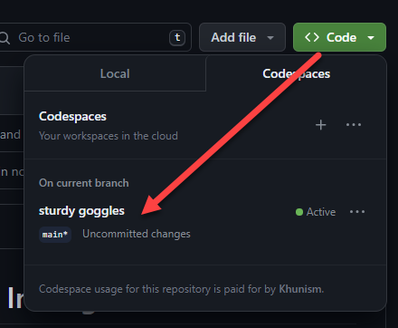
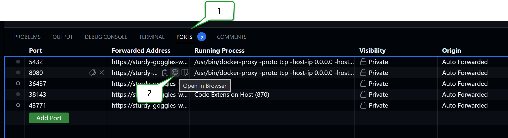
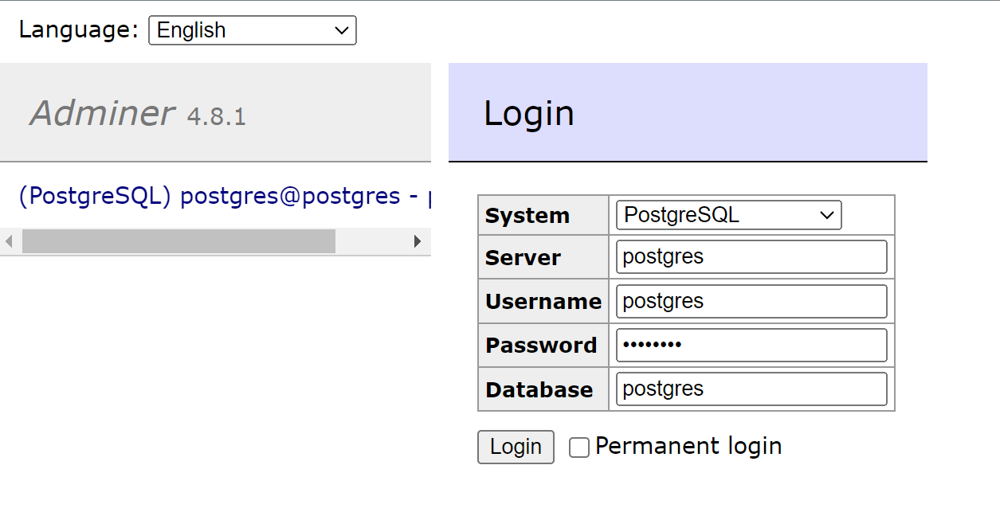
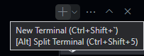
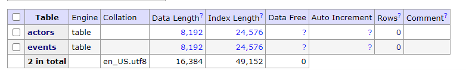

# Data Warehouse and Bisuness Intelligence
# Week 1 ดึงข้อมูลจาก .json เก็บลงฐานข้อมูล Postgres

## Create Github Account

นำใช้ในการ manage code และใช้งาน code space สำหรับรันโค๊ดต่างๆ

เพื่อให้เป็น env เดียวกันกับคนอื่น หากต้องการแชร์จะง่ายต่อการที่คนอื่นๆจะนำไปพัฒนาต่อยอด

โดยในครั้งแรกให้ทำการ Create Code space ขึ้นมาก่อน และหากเราปิด code space ไปแล้วก็ยังสามารถกลับมาใช้งานได้โดยเลือกไปที่ชื่อ code space เดิม

images/WK1_01.png

สร้าง folder ขึ้นมา 2 folder ชื่อ

- 01-data-modeling-i : สำหรับเก็บ Code ทั้งหมด
- data : สำหรับเก็บ Data Source

## **เตรียม Data Source**

- .json : https://github.com/zkan/swu-ds525/blob/main/data/github_events_01.json

## เตรียม Web server **nginx** โดยใช้งานผ่าน Docker

ที่ terminal

```powershell
docker run -p 8080:80 nginx
```

## เตรียม Postgres Web-Server Env. โดยใช้งานผ่าน Docker

ให้เตรียมไฟล์ docker-compose.yml

```yaml
version: "3.9"

services:
  postgres:
    image: postgres:13
    environment:
      POSTGRES_USER: postgres
      POSTGRES_PASSWORD: postgres
      POSTGRES_DB: postgres
    volumes:
      - postgres-data-volume:/var/lib/postgresql/data
    ports:
      - 5432:5432
  adminer:
    image: adminer:4.8.1
    restart: always
    depends_on:
      - postgres
    ports:
      - 8080:8080

volumes:
  postgres-data-volume:
```

ในการรัน code ใดๆนั้น ให้ทำการเข้าไปยัง path ที่ code นั้นๆอยู่ด้วย ในที่นี้จะใช้ชื่อ 01-da-modeling-i

ให้พิมพ์ใน terminal ว่า **cd 01-da-modeling-i** แล้วกด Enter

ในการรัน postgres server ขึ้นมานั้นให้ใช้คำสั่ง **docker-compose up**



ในการเข้า server ให้ไปที่ PORTS จากนั้นในส่วนของ port 8080 ให้กดที่ open in browser



ทำการ login ตาม user/pass ที่เรากำหนดไว้ ในที่นี้ใช้เป็น postgres



## Create Table สำหรับเก็บข้อมูล

โดย table ที่สร้างนี้จะประกอบด้วย table : actors และ events

ใน table actors จะเก็บข้อมูลเกี่ยวกับ user ที่ใช้งานว่าเป็น login name อะไร และใช้ id อะไร

ใน table events จะเก็บข้อมูลเกี่ยวกับ event ต่างๆที่ user นั้นๆได้กระทำ

ซึ่ง 2 table นี้สร้าง relation ด้วย id โดย actors : event แบบ one to many

- **create_table.py**

```python
from typing import NewType

import psycopg2

PostgresCursor = NewType("PostgresCursor", psycopg2.extensions.cursor)
PostgresConn = NewType("PostgresConn", psycopg2.extensions.connection)

table_drop_events = "DROP TABLE IF EXISTS events"
table_drop_actors = "DROP TABLE IF EXISTS actors"

table_create_actors = """
    CREATE TABLE IF NOT EXISTS actors (
        id int,
        login text,
        PRIMARY KEY(id)
    )
"""
table_create_events = """
    CREATE TABLE IF NOT EXISTS events (
        id text,
        type text,
        actor_id int,
        PRIMARY KEY(id),
        CONSTRAINT fk_actor FOREIGN KEY(actor_id) REFERENCES actors(id)
    )
"""

create_table_queries = [
    table_create_actors,
    table_create_events,
]
drop_table_queries = [
    table_drop_events,
    table_drop_actors,
]

def drop_tables(cur: PostgresCursor, conn: PostgresConn) -> None:
    """
    Drops each table using the queries in `drop_table_queries` list.
    """
    for query in drop_table_queries:
        cur.execute(query)
        conn.commit()

def create_tables(cur: PostgresCursor, conn: PostgresConn) -> None:
    """
    Creates each table using the queries in `create_table_queries` list.
    """
    for query in create_table_queries:
        cur.execute(query)
        conn.commit()

def main():
    """
    - Drops (if exists) and Creates the sparkify database.
    - Establishes connection with the sparkify database and gets
    cursor to it.
    - Drops all the tables.
    - Creates all tables needed.
    - Finally, closes the connection.
    """
    conn = psycopg2.connect(
        "host=127.0.0.1 dbname=postgres user=postgres password=postgres"
    )
    cur = conn.cursor()

    drop_tables(cur, conn)
    create_tables(cur, conn)

    conn.close()

if __name__ == "__main__":
    main()
```

จากนั้นสร้างไฟล์สำหรับ etl เพื่อนำข้อมูลจาก json เข้าไปยัง postgres

- etl.py

```python
import glob
import json
import os
from typing import List

import psycopg2

def get_files(filepath: str) -> List[str]:
    """
    Description: This function is responsible for listing the files in a directory
    """

    all_files = []
    for root, dirs, files in os.walk(filepath):
        files = glob.glob(os.path.join(root, "*.json"))
        for f in files:
            all_files.append(os.path.abspath(f))

    num_files = len(all_files)
    print(f"{num_files} files found in {filepath}")

    return all_files

def process(cur, conn, filepath):
    # Get list of files from filepath
    all_files = get_files(filepath)

    for datafile in all_files:
        with open(datafile, "r") as f:
            data = json.loads(f.read())
            for each in data:
                # Print some sample data
                
                if each["type"] == "IssueCommentEvent":
                    print(
                        each["id"], 
                        each["type"],
                        each["actor"]["id"],
                        each["actor"]["login"],
                        each["repo"]["id"],
                        each["repo"]["name"],
                        each["created_at"],
                        each["payload"]["issue"]["url"],
                    )
                else:
                    print(
                        each["id"], 
                        each["type"],
                        each["actor"]["id"],
                        each["actor"]["login"],
                        each["repo"]["id"],
                        each["repo"]["name"],
                        each["created_at"],
                    )

                # Insert data into tables here
                insert_statement = f"""
                    INSERT INTO actors (
                        id,
                        login
                    ) VALUES ({each["actor"]["id"]}, '{each["actor"]["login"]}')
                    ON CONFLICT (id) DO NOTHING
                """
                # print(insert_statement)
                cur.execute(insert_statement)

                # Insert data into tables here
                insert_statement = f"""
                    INSERT INTO events (
                        id,
                        type,
                        actor_id
                    ) VALUES ('{each["id"]}', '{each["type"]}', '{each["actor"]["id"]}')
                    ON CONFLICT (id) DO NOTHING
                """
                # print(insert_statement)
                cur.execute(insert_statement)

                conn.commit()

def main():
    conn = psycopg2.connect(
        "host=127.0.0.1 dbname=postgres user=postgres password=postgres"
    )
    cur = conn.cursor()

    process(cur, conn, filepath="../data")

    conn.close()

if __name__ == "__main__":
    main()
```

ในการ run .py ให้ใช้ terminal อันใหม่ โดยเลือก New terminal



แล้วใช้คำสั่งว่า 

```python
python create_table.py
python etl.py
```

เมื่อรันแล้วจะได้ data ใน postgres เป็นอันเสร็จสิ้นในการ import data from json to postgres


