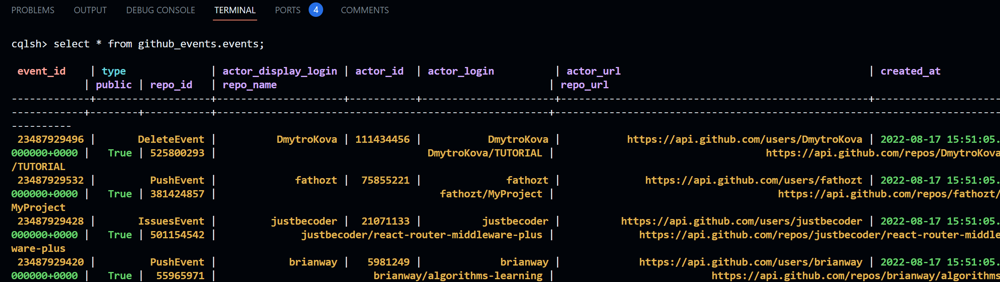

# DWH & BI [ Week 2 ]

## **ดึงข้อมูลจาก .json เก็บลงฐานข้อมูล Cassandra**

จะเขียนย่อกว่า week 1 นิดหน่อยเพราะเคยทำผ่านมือกันมาบ้างแล้วนะ

1. เปลี่ยน Directory ให้อยู่ใน Folder 02-data-modelling-I

```powershell
cd 02-data-modeling-ii
```

1. ในการรัน **Cassandra** ขึ้นมานั้นให้ใช้คำสั่ง

```powershell
docker-compose up
```

แต่เนื่องจากไม่สามารถเข้าใช้งาน ผ่าน port 9042 ได้จึงทำการ install cqlsh

```powershell
pip install cqlsh
```

หลังจากเตรียม cassandra เสร็จแล้ว เราจึงมาทำการสร้าง table และ insert ข้อมูลเข้าไป

```powershell
python etl.py
```

ในการเรียกใช้งานให้พิมพ์ว่า cqlsh โดยจะใช้ terminal คนละตัวกับที่รัน cassandra นะครับ

```powershell
cqlsh
select * from github_events.events;
```

ผลที่ได้
