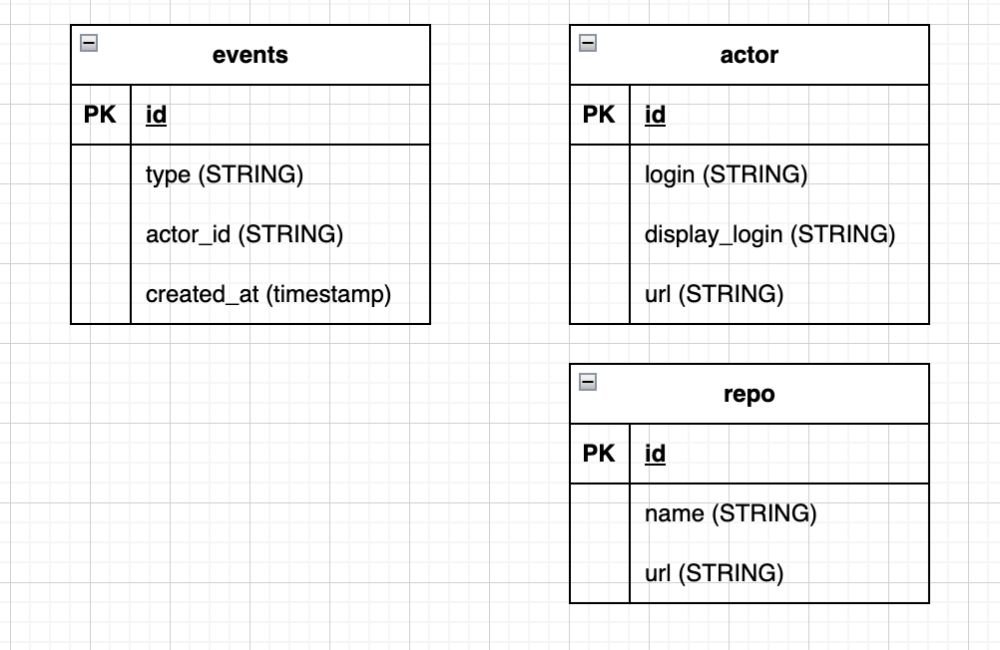
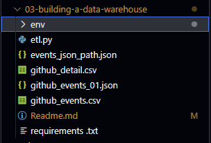
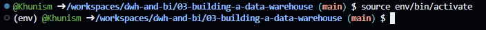
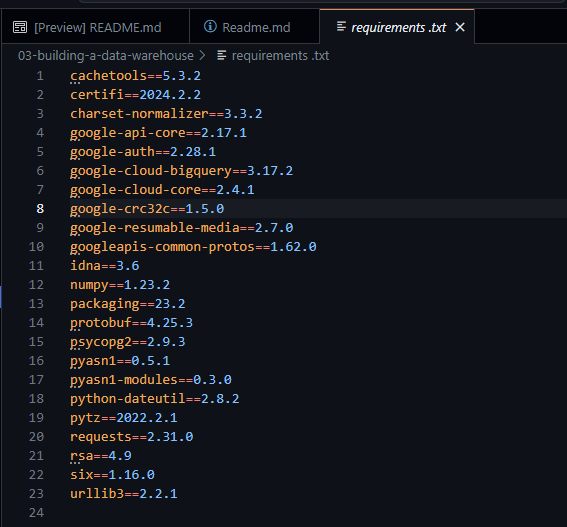

## Data model



<br>
<br>

## Documentation

1. เปลี่ยน Directory ให้อยู่ใน Folder 03-building-a-data-warehouse
```
$ cd 03-building-a-data-warehouse
```
2. สร้าง Environment Python เพื่อรองรับการการติดตั้ง Library ให้เหมาะสมกับงาน
```
$ python -m venv env 
```



3. Active Env. ที่สร้างไว้ให้สามารถใช้งานได้
```
$ source env/bin/activate
```



4. Install Library ที่เกี่ยวข้องกับการใช้งาน
```
$ pip install -r requirements.txt
```


5. สร้าง Key ใน Google query เพื่อให้สามารถสร้าง Scipt python เพื่อ Google bigquery ได้


6. จากนั้นนำไฟล์ JSON แล้วเก็บไว้ในคอมฯของเรา


7. สร้าง Folder จัดเก็บไฟล์ JSON ใน code space หากอยู่ folder เดียวกับไฟล์ etl.py ไม่จำเป็นต้องมี ../credentials/ สามารถใช้ชื่อไฟล์ได้เลย
project_id มาจาก project name บน Bigquery หรือ สามารถดูได้จากไฟล์ Key ใน JSON ได้เช่นกัน


8. การสร้าง tables และเพิ่มข้อมูลสามารถทำได้ในไฟล์ etl.py ข้อมูลที่เข้ามาจะขึ้นอยู่กับโครงสร้าง และข้อมูลที่กำหนดในไฟล์ etl.py
ในงานนี้จะให้ file_path = github_detail.csv และ ใช้ข้อมูล github_events_01.json
```
$ python etl.py
```


